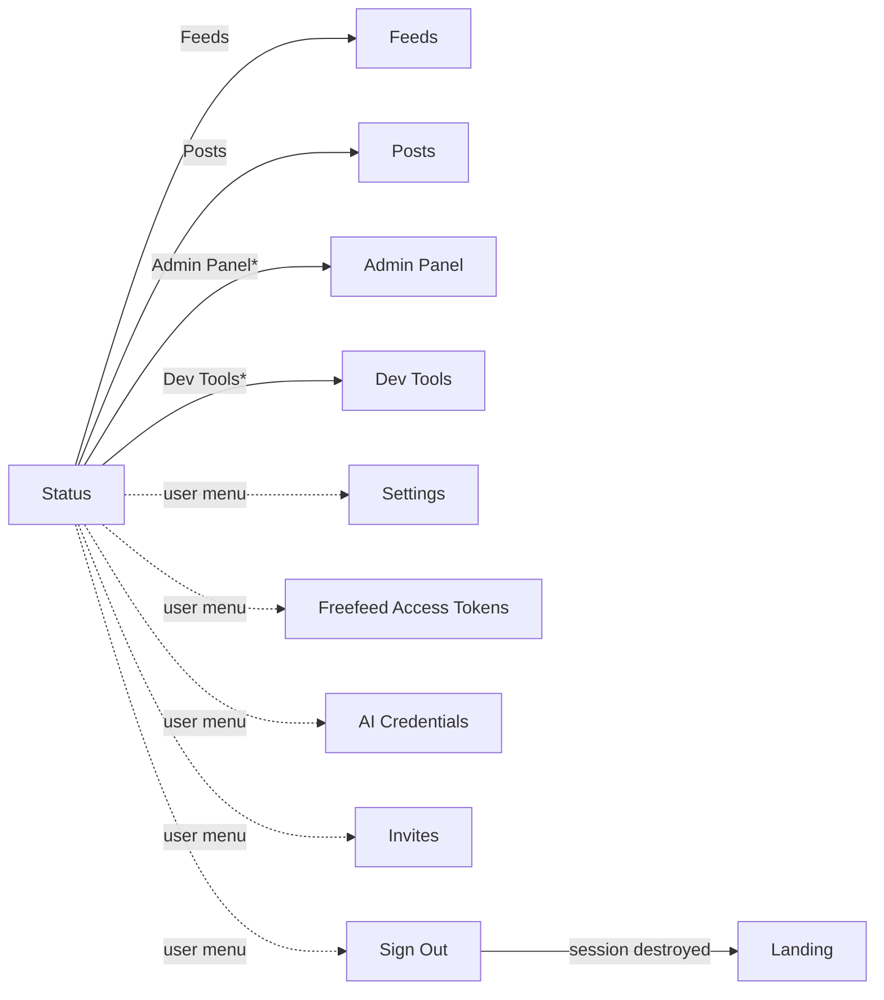
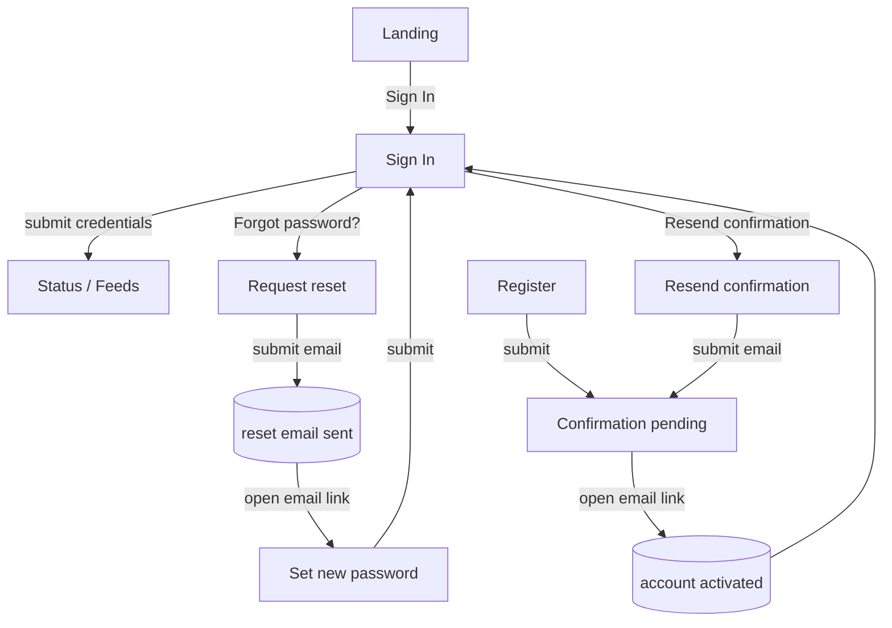
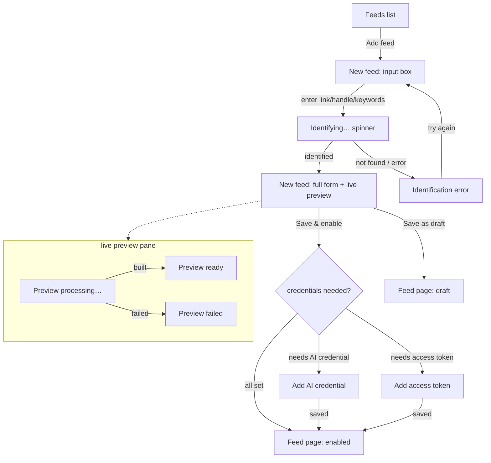
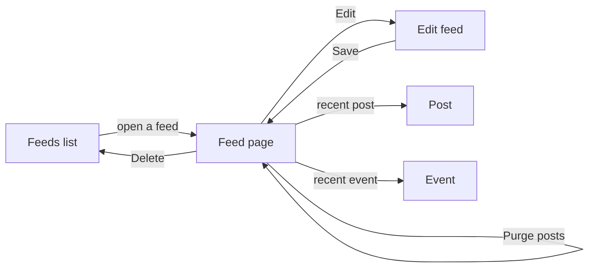
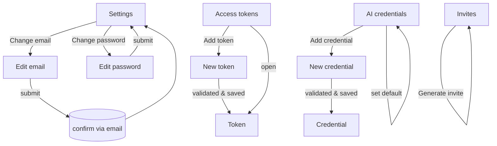

# App Map (user-facing view states)

Illustrative maps of the screens a user moves through and the actions that
move them. Nodes are views, arrows are transitions, labels are the user
action (with the relevant `controller#action` where it helps). These are
sketches for orientation, not a formal spec — the code is the source of truth.

One diagram per flow keeps each readable.

## Top-level navigation (signed in)

`*` Admin Panel and Dev Tools appear only for users with the matching
permission. The four user-menu items live behind the avatar dropdown.

## Authentication & registration

## Smart feed creation

The central flow. The "new feed" page starts as a single input box and
progressively expands as the feed is identified and previewed.

## Feed management

## Account & settings

